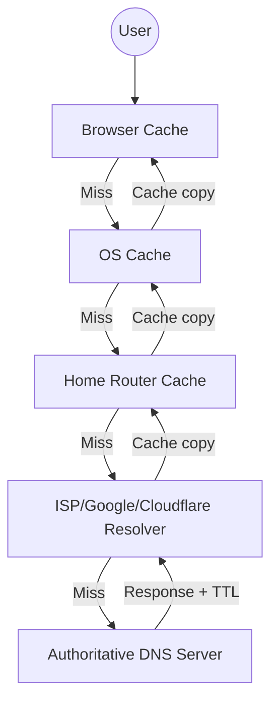

# Caching & DNS: A Comprehensive Learning Guide

Caching is one of the most fundamental concepts in computer science. It is the practice of storing copies of data in a high-speed storage layer to serve future requests faster. This document explores caching from basic principles to its complex application in the global Domain Name System (DNS).

---

## 📑 Table of Contents
1. [What is Caching?](#1-what-is-caching)
2. [Why We Cache (Problems Solved)](#2-why-we-cache-problems-solved)
3. [Caching Layers in Modern Systems](#3-caching-layers-in-modern-systems)
4. [General Caching Strategies & Eviction](#4-general-caching-strategies--eviction)
5. [Advanced Application Caching (Redis & Strategies)](#12-advanced-application-caching-redis--strategies)
6. [Caching Granularity (Query vs Object level)](#13-caching-granularity-query-vs-object-level)
7. [Case Study: The Domain Name System (DNS)](#5-case-study-the-domain-name-system-dns)
8. [Public vs. Private IP Addresses](#6-public-vs-private-ip-addresses)
9. [DNS as a Distributed Caching System](#7-dns-as-a-distributed-caching-system)
10. [Conceptual Aids (Analogies)](#8-conceptual-ids-analogies)
11. [Common Pitfalls & Mistakes](#9-common-pitfalls--mistakes)
12. [Testing & Troubleshooting](#10-testing--troubleshooting)
13. [Learning Path & Resources](#11-learning-path--resources)

---

## 1. What is Caching?
At its core, a cache is a **temporary storage area** that is smaller and faster than the primary data source. 

- **The Mechanic**: When data is requested, the system first checks the cache (**Cache Hit**). If found, it returns the data instantly. If not (**Cache Miss**), it fetches it from the slow primary source, stores a copy in the cache, and returns it.

### Why it matters
In a world of sub-millisecond expectations, waiting for a physical disk to spin or a signal to travel halfway across the globe is unacceptable. Caching bridges the gap between **slow, massive storage** and **fast, immediate demand**.

---

## 2. Why We Cache (Problems Solved)
Caching is not just about "speed"; it's about system survival.

1.  **Reduced Latency**: Moving data closer to the user (e.g., CDN) or into faster hardware (e.g., RAM vs. Disk).
2.  **Increased Throughput**: One single cache node can serve thousands of requests per second that would otherwise crush a database.
3.  **Cost Efficiency**: Reduces expensive operations like cloud database "Read Units" or high-bandwidth cloud exits.
4.  **Graceful Degradation**: If the primary source (DB) is temporarily down, the system can still serve "stale" but useful data from the cache.

---

## 3. Caching Layers in Modern Systems

| Layer | Type | Responsibility |
| :--- | :--- | :--- |
| **Web Browser** | Client-Side | Stores images, CSS, and JS files locally on your machine. |
| **CDN** | Network Edge | Stores static assets (videos, images) at servers physically close to the user. |
| **Proxy Cache** | Infrastructure | Intermediate servers (like Nginx) that cache responses for multiple users. |
| **App Cache** | Server-Side | In-memory data structures (like Redis) used by your code to store session data or API results. |
| **DB Cache** | Database | Buffer pools and query caches inside Postgres/MySQL to avoid disk I/O. |
| **OS Cache** | Hardware/Kernal| Page caches in the OS memory to keep frequently accessed files in RAM. |

---

## 4. General Caching Strategies & Eviction

### Writing Strategies
- **Cache-Aside**: App checks cache, then DB. Most common for general apps.
- **Write-Through**: Write to cache and DB at the same time. High consistency, higher latency for writes.
- **Write-Back (Write-Behind)**: Write to cache only; sync to DB later. Extremely fast, but risk of data loss on crash.

### Eviction: Deciding what to delete
Since caches are limited in size, we must have a "cleaning" policy:
- **LRU (Least Recently Used)**: Tosses the item that hasn't been touched for the longest time. (Library analogy: Toss the book no one has checked out in years).
- **LFU (Least Frequently Used)**: Tosses the data with the fewest number of hits.
- **FIFO**: Simple "First In, First Out" queue.

---

## 5. Case Study: The Domain Name System (DNS)

DNS is the "Phonebook of the Internet." It translates a human-readable name like `google.com` into an IP address like `142.250.190.46`.

### Why Caching is Mandatory in DNS
Every single click on the internet triggers a DNS lookup. Without caching, the "Root Servers" of the internet would be crushed by trillions of requests per second, and your web browsing would feel like 1995.

### The Resolution Hierarchy
When you ask for `www.example.com`:
1.  **DNS Resolver (Recursive)**: Your local "detective" (Google 8.8.8.8 or your ISP).
2.  **Root Name Servers**: Directed to the TLD servers.
3.  **TLD (Top Level Domain) Servers**: Handles `.com`, `.org`, etc.
4.  **Authoritative Servers**: The final source of truth for `example.com`.

### The Root Server System: The 13 Addresses
You might hear people say there are "only 13 DNS root servers." This is a technical simplification:
- There are **13 logical IP addresses** (labeled `a.root-servers.net` through `m.root-servers.net`).
- However, each of these addresses is **Anycast**.
- **Anycast** means hundreds of physical servers all over the world broadcast the same 13 IP addresses. The network routes your request to the **physically closest** server.

### TTL (Time To Live)
TTL is a value (in seconds) that the publisher of a DNS record attaches to the response. 
- **High TTL (e.g., 86400s / 1 day)**: Good for stability. Caches keep the data for a long time. Changes take a day to propagate.
- **Low TTL (e.g., 60s)**: Crucial for sub-second failover. Caches must re-verify frequently.

### Layers of DNS Cache
DNS isn't one cache; it's a **Russian Doll** of caches:
> **Browser Cache** → **OS Cache** → **Local Router Cache** → **ISP/Public Resolver Cache**

---

## 6. Public vs. Private IP Addresses

- **Private IPs**: Used inside your home/office network (e.g., `192.168.1.1`). They are not reachable from the internet.
- **Public IPs**: Unique addresses on the global internet. 

**Why DNS matters here**: DNS exists primarily to map names to **Public IPs**. When you type `myserver.local`, that's usually handled by internal caching, but `google.com` *must* resolve to a public IP for you to reach it over the internet.

---

## 7. DNS as a Distributed Caching System

DNS is the world's largest distributed system.

### The Architecture


### Pros & Cons of the Distributed Model
- **Pros**: Incredible scalability (no single point of failure), extreme speed (lookup usually takes <50ms).
- **Cons**: "Propagation Delay." If you delete a record, some people might see the old one for hours because their local cache hasn't expired yet.

---

## 8. Conceptual Aids (Analogies)

### The Library Analogy
- **Data Source**: The massive stack of millions of books in the deep basement.
- **Cache**: The small cart on the 1st floor containing the "Top 10 Bestsellers."
- **Cache Hit**: Someone asks for a bestseller; you hand it over instantly.
- **Cache Miss**: Someone asks for an obscure 1920s poetry book. You must go to the basement, find it, bring it up, and maybe put it on the cart (cache) because you expect others might ask for it soon.

### The GPS Analogy (for DNS)
- **Root Server**: A massive signpost that only points to "California" or "New York."
- **TLD Server**: A person in California who points you to "Los Angeles."
- **Authoritative Server**: The specific person at `123 Main St` who tells you exactly where the keys are.
- **Caching**: Memorizing that `123 Main St` is in Los Angeles so you don't have to ask the signpost again tomorrow.

---

## 9. Common Pitfalls & Mistakes

1.  **Over-caching**: Caching everything "just in case." This leads to memory exhaustion and complex stale-data bugs.
2.  **Forgetting Invalidation**: Relying on TTL only while data has changed. "Cache invalidation is one of the two hard things in Computer Science."
3.  **Security Gaps**: 
    - **Cache Poisoning**: Injecting fake data into a DNS cache to redirect users to a malicious site. **Mitigation**: Use **DNSSEC** (Digital signatures for DNS).
4.  **Monitoring**: Not knowing your **Cache Hit Ratio**. If your ratio is < 10%, your cache might be useless or improperly configured.

---

## 10. Testing & Troubleshooting

### Tools of the Trade
- **`dig` (Domain Information Groper)**: The gold standard for DNS. It shows you the TTL and which server answered.
  - `dig google.com`
- **`nslookup`**: Windows-friendly alternative for quick lookups.
- **`ipconfig /displaydns`**: View your local Windows DNS cache.
- **`ipconfig /flushdns`**: Clear your local cache to force a fresh lookup.

### Observing TTL
Run `dig google.com` multiple times. You will see the `ANSWER SECTION` time value decreasing with every call. This is the **TTL counting down** in your local resolver's cache!

---

## 11. Learning Path & Resources

### The Path to Mastery
1.  **Step 1: The Basics**: Understand RAM vs Hard Drive speed.
2.  **Step 2: App Caching**: Implement Redis in a small project (like the C# example in this repo).
3.  **Step 3: DNS Mechanics**: Use `dig` to trace a domain from root to leaf.
4.  **Step 4: CDNs**: Host a site on Vercel or Netlify and observe how assets change when you redeploy.
5.  **Step 5: Distributed Systems**: Study the CAP theorem and see how it applies to "Eventually Consistent" caches.

### Authoritative Resources
- **[High Scalability](http://highscalability.com/)**: Real-world architecture case studies.
- **[RFC 1034 / 1035](https://datatracker.ietf.org/doc/html/rfc1034)**: The original specifications of DNS.
- **[The System Design Primer](https://github.com/donnemartin/system-design-primer)**: Deep sections on caching and scalability.
- **[Cloudflare Learning Center](https://www.cloudflare.com/learning/)**: Excellent visual guides on DNS, anycast, and CDNs.

---
> [!TIP]

---

## 12. Advanced Application Caching (Redis & Strategies)
In-memory caches such as **Memcached** and **Redis** are key-value stores between your application and your data storage. Since data is held in RAM, it is much faster than typical databases where data is stored on disk.

### Redis: Beyond Simple Caching
Redis is more than just a key-value store. It provides:
- **Persistence Options**: Can save data to disk while keeping it in RAM.
- **Built-in Data Structures**: Sorted sets (for leaderboards), Lists (for queues), and Bitmaps.

---

## 13. Caching Granularity (Query vs Object level)

### A. Database Query Level Caching
Whenever you query the database, hash the query as a key and store the result.
- **Problem**: Hard to invalidate. If one row in a table changes, you might need to delete all cached queries that referenced that table.

### B. Object Level Caching (Recommended)
See your data as an object (e.g., a User instance). Assemble the data into a class or structure.
- **Async Processing**: Workers can assemble objects by consuming the latest cached data.
- **Easier Invalidation**: Remove the specific object if its underlying data changes.

**What to cache?**: User sessions, fully rendered web pages, activity streams, and user graph data.

---

## 14. Detailed Write Strategies

### 1. Cache-Aside (Lazy Loading)
The application is responsible for reading and writing from storage. The cache does not interact with the database directly.

```python
# Pseudo-code example
def get_user(user_id):
    user = cache.get(f"user.{user_id}")
    if user is None:
        user = db.query("SELECT * FROM users WHERE id = %s", user_id)
        if user is not None:
            cache.set(f"user.{user_id}", json.dumps(user))
    return user
```
- **Disadvantage**: Noticeable delay on cache miss (3 trips); data staleness risk.

### 2. Write-Through
The application uses the cache as the main data store. The cache synchronously writes to the database.
- **Pros**: Data in cache is never stale.
- **Cons**: Slow overall write operation.

### 3. Write-Behind (Write-Back)
The application updates the cache and the cache **asynchronously** writes to the data store.
- **Pros**: Extremely fast write performance.
- **Cons**: Risk of data loss if the cache node fails before the write hits the DB.

### 4. Refresh-Ahead
The cache automatically refreshes recently accessed entries BEFORE they expire.
- **Pros**: Reduced latency if predictions are accurate.
- **Cons**: Poor predictions result in wasted performance and resources.

---

> [!CAUTION]
> **Fundamental Challenge**: Caching always introduces the problem of **Consistency**. Maintaining synchronization between the source of truth (DB) and the cache is a design complexity that must be weighed against performance gains.
